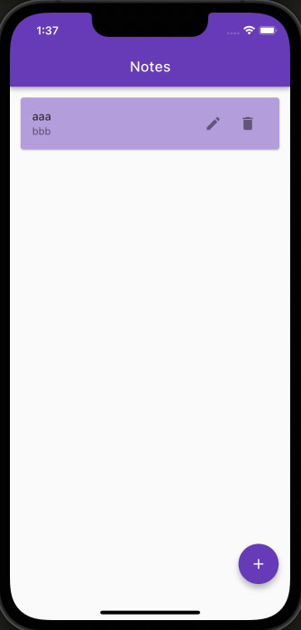
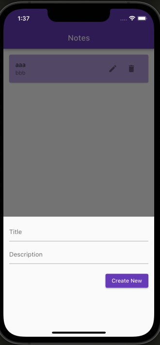

# flutter sqflite sample app
sqfliteを用いた簡単なデモアプリです。
[こちらのサイト](https://kimuralog.com/?p=2283)を参考に作成しています。
# images


# env
```
Dart SDK version: 3.1.0
Flutter 3.13.0 
```

# run
```
flutter pub get
```

web以外でビルド
```
flutter run
```

# package
- [sqflite 2.3.0 ](https://pub.dev/packages/sqflite)
- [hooks_riverpod 2.4.0 ](https://pub.dev/packages/hooks_riverpod/install)
- [flutter_hooks 0.20.1 ](https://pub.dev/packages/flutter_hooks)
